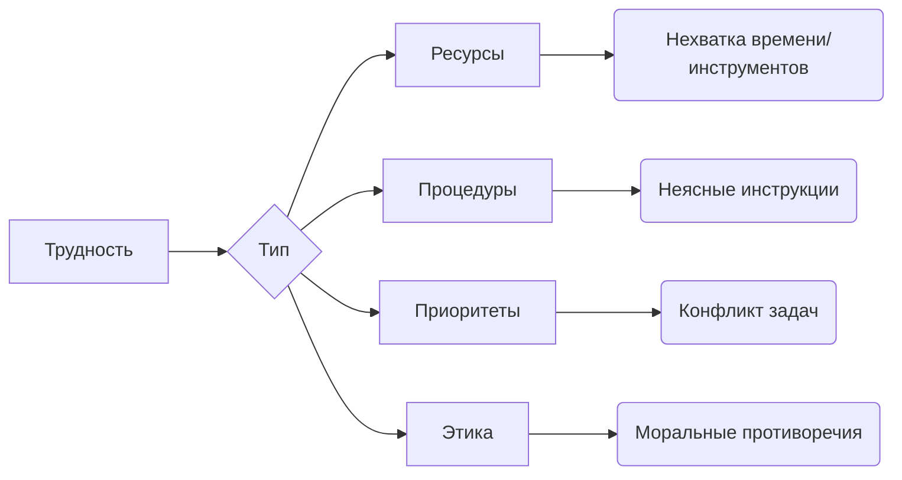

Коллеги, этот принцип - основа стабильной работы Академии. Когда решение прошло этап обсуждения и утверждено, оно становится обязательным для исполнения. 

---

### ❗ Почему это критически важно?
*   **Предсказуемость:** Согласованные действия всей команды создают надежную среду для учеников
*   **Эффективность:** Реализация стратегических планов без постоянных корректировок
*   **Доверие:** Гарантия что решения не останутся на бумаге
*   **Фокус на детях:** Энергия тратится на обучение, а не на внутренние конфликты
*   **Юридическая защита:** Соблюдение регламентов работы образовательной организации

---

### 🧭 Границы принципа: Что можно и нельзя

**✅ Допустимо до принятия решения:**
- Активно предлагать альтернативы
- Требовать дополнительные данные
- Высказывать обоснованные сомнения
- Обсуждать потенциальные риски

**❌ Недопустимо после принятия решения:**
- Открытый отказ от исполнения
- Пассивное сопротивление ("забыл", "не успел")
- Критика решения в коллективе
- Сознательное искажение сути решения
- Создание альянсов против реализации

---

### 🛠 Алгоритм действий при трудностях в исполнении

1.  **Примите решение как факт:**  
    "Это утвержденная процедура, моя задача - реализовать её"
    
2.  **Выявите конкретную сложность:**
    - Технические проблемы (нет доступа, не работает система)
    - Ресурсные ограничения (нехватка времени, материалов)
    - Процедурные неясности (непонятны шаги реализации)
    - Конфликт задач (наложение на другие обязанности)

3.  **Используйте правильные каналы:**
    ```markdown
    - Техника/ресурсы → [IT-поддержка]([[Контакты_IT]])
    - Процедуры/инструкции → [Методический отдел]([[Контакты_Метод_Отдел]])
    - Организация времени → [Ваш куратор]([[Контакты_Кураторы]])
    - Срочные вопросы → [Чат экстренной помощи]([[Чат_Срочные_Вопросы]])
    ```



3.  **Предложите адаптацию в рамках решения:**  
    "Для выполнения задачи Y предлагаю вариант X, который сохранит суть решения, но учтет особенность Z"

---

### 🚫 Примеры нарушений и их последствия

| Ситуация                     | Правильная реакция               | Нарушение                     |
|------------------------------|----------------------------------|-------------------------------|
| Новый порядок заполнения журнала | "Исполняю. Обнаружил дублирование данных. Предлагаю автоматизацию через модуль Х" | "Это неудобно!" → Продолжение работы по-старому |
| Изменение расписания          | "Работаю по новому графику. Оптимизировал логистику через Y" | "Не согласен!" → Игнорирование новых сроков |
| Требование по оформлению кабинетов | "Выполняю. Нужны дополнительные крючки для материалов. Запросил через [[Форма_Запрос_Ресурсов]]" | "Безобразие!" → Саботаж через некачественное исполнение |

> **Важно:** Повторные нарушения рассматриваются на педагогическом совете и влияют на профессиональную аттестацию.

---

### ⚠️ Особый случай: Этические конфликты

Если решение:
1. Нарушает законодательство РФ
2. Угрожает безопасности детей/сотрудников
3. Противоречит профессиональной этике

**Действуйте немедленно:**
1. Приостановите исполнение
2. Заполните [Экстренную форму]([[Форма_Этические_Конфликты]])
3. Оповестите завуча через [Срочный чат]([[Чат_Экстренные_Ситуации]])
4. Получите решение комиссии в течение **24 часов**

---

### 💼 Практикум: Реальные кейсы Академии

**Кейс 1:** Внедрение электронного журнала  
- *Ошибка:* "Система неудобна!" → Частичное использование  
- *Решение:* "Освоил модуль Х за 2 дня. Обнаружил проблему Y. Предлагаю инструкцию для коллег → [[Гайд_Электронный_Журнал_v2]]"

**Кейс 2:** Требование носить бейджи  
- *Ошибка:* "Это бессмысленно!" → Бейдж в кармане  
- *Решение:* "Исполняю. Предложил дизайн с именем и предметом → [[Макет_Бейджа_Педагога]]. Ученикам стало проще обращаться"

---

### 🛡 Ваши инструменты поддержки
- Запрос ресурсов: [[Форма_Запроса_Ресурсов]]
- Уточнение процедур: [[Контакты_Метод_Поддержки]]
- Этические вопросы: [[Форма_Этические_Дилеммы]]
- Срочные консультации: [[Чат_Завуча_Срочно]]
- Обратная связь: [[Форма_ОС_После_Реализации]]

> **Помните:** Ваша профессиональная целостность проявляется не только в преподавании, но и в отношении к общим решениям.  
> Благодарю за дисциплину и ответственность! 🤝  
> // [Ваше Имя], Завуч