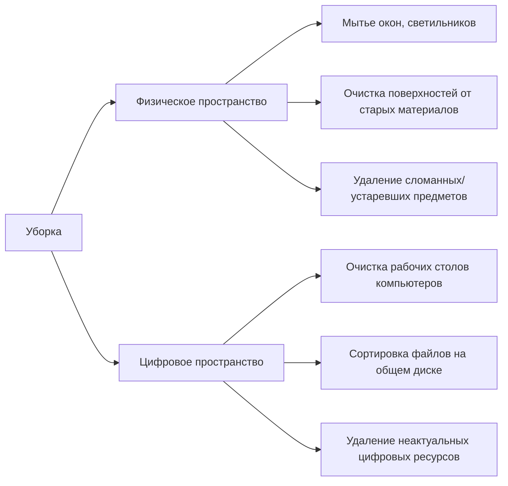

## 🧹 Наведение порядка в кабинетах: Создание идеальной учебной среды

### 🎯 Цель
Превратить каждый кабинет в **безопасное, функциональное и вдохновляющее пространство**, где:
- Ученики чувствуют комфорт и концентрацию
- Педагоги эффективно реализуют методики
- Материалы доступны в 1 клик
- Эстетика способствует любви к знаниям

### 🔍 Глубокий фокус на ключевых аспектах

#### 1. Расхламление и глубинная уборка

**Нормы чистоты:**

- ✅ Все поверхности без пыли
    
- ✅ Полы без пятен и мусора
    
- ✅ Шкафы с прозрачными дверцами
    
- ✅ Отсутствие посторонних запахов
    

---

#### 2. Безопасность мебели и оборудования

**Критические точки проверки:**

markdown

Copy

Download

| Объект          | Параметры безопасности                  | Инструмент проверки       |
|-----------------|-----------------------------------------|---------------------------|
| Стулья          | Устойчивость, отсутствие трещин         | [[Чек-лист_Мебель]]       |
| Столы           | Закрепленные ножки, ровная столешница   | Визуальный осмотр         |
| Шкафы/стеллажи | Надежность креплений к стене            | Тест на раскачивание      |
| Розетки         | Защитные шторки, отсутствие оголенных проводов | [[Гайд_Электробезопасность]] |
| Окна            | Исправность фурнитуры, ограничители открывания | [[Форма_Проверки_Окон]] |

**Требования:**

- ❌ Недопустимы острые углы на уровне детей
    
- ❌ Запрещены неустойчивые конструкции
    
- ✅ Обязательны резиновые накладки на ножках мебели
    

---

#### 3. Интеллектуальная организация систем хранения

**Принципы системы 5S:**

diff

Copy

Download

+ Sort (Сортировка) - оставить только необходимое
+ Set in order (Расположение) - каждому предмету место
+ Shine (Чистота) - содержание в идеальном порядке
+ Standardize (Стандартизация) - единые правила для всех
+ Sustain (Совершенствование) - поддержка стандарта

**Конкретные решения:**

- Система цветовой маркировки → [[Гайд_Цветовой_Кодировки]]
    
- Вертикальное хранение с прозрачными контейнерами
    
- Зоны хранения:
    
    - 🟦 Синяя - ученические материалы
        
    - 🟩 Зеленая - методические пособия
        
    - 🟥 Красная - лабораторное оборудование
        
    - 🟨 Желтая - творческие работы
        

---

#### 4. Обновление информационных стендов

**Обязательные элементы:**

markdown

Copy

Download

1. [ ] Актуальное расписание
2. [ ] Правила безопасности (пожарная, электробезопасность)
3. [ ] Достижения класса (грамоты, фото проектов)
4. [ ] Методические материалы месяца
5. [ ] Интерактивный элемент (QR-код на цифровые ресурсы)

**Требования к оформлению:**

- ✅ 30% свободного пространства
    
- ✅ Шрифт Arial/Open Sans не менее 24пт
    
- ✅ Высота нижнего края 1.5м от пола
    
- ✅ Единый стиль оформления → [[Брендбук_Академии]]
    

---

### 🛠 Инструменты контроля

**Чек-лист "Готовность кабинета 2024" → [[Чек-лист_Готовность_Кабинета_2024]]**  
_Примеры критических пунктов:_

- Отсутствие растений с аллергенными свойствами
    
- Наличие аптечки первой помощи (срок годности)
    
- Маркировка розеток 220В предупреждающими знаками
    
- Закрепление проектора/ТВ с двойным креплением
    

**Цифровая карта кабинета → [[Шаблон_Цифровая_Карта_Кабинета]]**

- План расстановки мебели
    
- Схема хранения материалов
    
- Фотофиксация ключевых зон
    

---

### ⚙️ Поддержка и ресурсы

**Для запросов:**

markdown

Copy

Download

1. Заявки на ремонт → [[Форма_Заявка_Хоз_Потребности]]
   - Тип: Электрика / Сантехника / Мебель / Отделка
   - Срочность: 🔴 Критичная / 🟠 Средняя / 🟢 Плановая

2. Запрос уборки → [[Система_Бронирования_Уборки]]
   - Глубокая (4ч) / Стандартная (2ч) / Экспресс (1ч)

**График поддержки:**

|Дата|Ответственный|Вид поддержки|
|---|---|---|
|25.08|АХО|Вывоз мусора|
|26-27.08|Технический отдел|Крепление мебели, розеток|
|28.08|Дизайнер|Консультации по оформлению|
|29.08|IT-отдел|Настройка цифровых стендов|

---

### 🌟 Мотивационная программа

**Участвуйте в конкурсе "Кабинет мечты":**

1. Сделайте фото "До" и "После" → [[Папка_Фото_Конкурс]]
    
2. Заполните анкету преобразований → [[Форма_Описание_Проекта]]
    
3. Призы:
    
    - 🥇 Проектор Epson EB-725Wi
        
    - 🥈 Комплект методических материалов
        
    - 🥉 Сертификат на профессиональную фотосессию
        

**Критерии оценки:**

- Функциональность (40%)
    
- Безопасность (30%)
    
- Эстетика (20%)
    
- Инновационность (10%)
    

---

> **Философия пространства:**  
> "Кабинет - третьий учитель. Создаем среду, где каждый элемент обучает!"  
> **Дедлайн готовности:** 25 августа 2024 года  
> Фотоотчеты приветствуются в → [[Чат_Педагоги_Обмен]]  
> Благодарим за создание пространств, в которые хочется возвращаться! 🌿✨